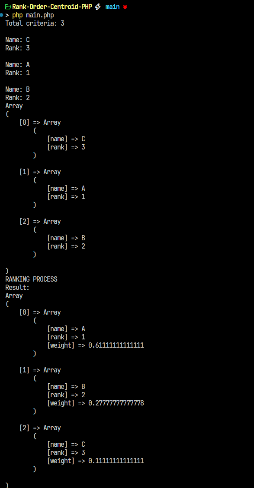

# Rank-Order-Centroid-PHP
This project is a simple implementation of the Rank Order Centroid (ROC) method using PHP. ROC is a technique commonly used in decision support systems to assign weights to criteria based on their rank. 

## 🏃🏻‍♂️ How to run this program ?

1. Make sure PHP is installed on your computer.
2. Open your terminal and run the following command:

    ```php
    php main.php
    ```

## Example Output


